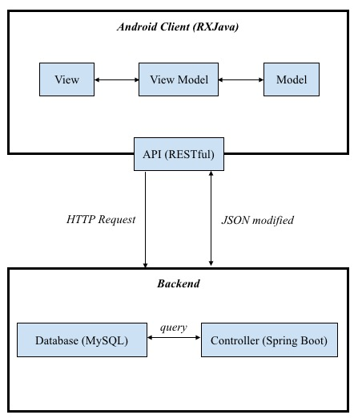

# <center>开题报告 </center>
<center>

王戈扬  
王  林
白银川
张依林
彭一明

2018年4月7日
</center>

## 目录

[TOC]

## 项目背景与动机  
人工智能应用离开数据积累无异于“无米之炊”，数据资源作为人工智能的三大基础条件之一，其重要性不言而喻。基于深度学习的模型训练，正是建立在大量样本数据的基础之上，样本数据的数量和质量，都将影响到模型表现的好坏。因此在人工智能、各种神经网络算法前提下，我们对于给进去的数据需要有一个专门的筛选和预处理的阶段。在现有的工业界里，已经有多家的数据标注平台在行业内“生产”这样的资源。对比于传统的PC端的数据标注，在现代移动互联网占据用户更多时间的前提下，一种能够让用户简便和快速完成任务的移动标注平台十分值得推广。
## 项目介绍  
人工智能的实现的确需要很多“人工”的部分，现在大部分的平台都是在以“万”为单位的级别下来进行数据标注，虽然在数量上达到了机器学习可用的级别，随着一些数据标注的研究结果却发现，单人单日的数据比（400条数据 / 人）已经会对数据的质量有一定的影响了。与以庞大数据作为标注对象进行对比，本项目是一种轻量级数据标注的移动应用补充，在用户群体上选择移动设备占有率最大的安卓平台，目标用户的范围跨度较大，用户可以在该平台上利用工作之余的时间完成一些小任务，并在提交的结果被发布方接受后得到一定的积分奖励。 在标注的数量问题上，系统会有目的的将大任务划分为颗粒度更细的小任务，以便能够做到任务的轻量化和多人同时标注；而在提升数据标注结果的质量问题上，我们采用积分反馈的方式来逐步完善平台数据的可用性。
## 项目目标
初步的实现一个简便、轻量的安卓移动数据标注平台，提供给广大普通用户短时间数据标注的使用，给任务发布方反馈较为优秀的标注结果。
## 项目功能分析
根据本软件产品的特点和使用场景给出其考虑来源和对应功能：

1.轻量化——任务上，系统通过算法和目的性的筛选把一个大数量的标注任务划分为众多小数量的小任务推送给用户，时间消耗上不会占用用户的太多时间，也能够一定程度上确保标注结果的质量可靠。

2.移动平台的选择——把数据标注设计为移动可接触的，间接的增加了同一数据被多人标注的可能性，在方便用户使用的情况下也提高了被标注数据的数量。

3.集成了数据采集和数据标注的流水线模式——一个平台做两件事，即满足了任务发布方的不停需要，也能够在数据的来源和使用去向做统一的管理。

4.多种标注类型支持——包含常见的几种数据标注形式：分类/标签标注、标框标注、描点标注。

## 软件架构
### 1. 项目用例
#### 用户
1. 注册、登陆、申请成为高级用户
* 登陆后显示主界面
2. 查看、更改用户信息
* 主界面右滑后显示用户基本信息
* 点击详细信息按钮，弹出界面显示所有用户信息。——>点击编辑可以修改信息——>退出并保存
* 点击头像，可以从相册中选择照片作为头像
3. 查看积分
* 主界面右滑, 在用户信息下显示积分

4. 查看任务情况
* 主界面右滑，个人信息下选择任务信息按钮
* 出现任务信息界面，可以查看正在进行任务或已完成任务
> 高级用户，可以查看已发布任务，并且可以选择已完成的图片采集任务转为图片标注任务发布


#### 任务
分为标注任务 采集任务
##### 发布任务
1. 发布图片/视频采集任务
* 选择发布任务-图片/视频采集任务
* 填写标签和其他信息，上传图片/视频采集任务
2. 标注任务
* 选择发布任务-图片标注任务
* 转到已发布任务界面
* 选择一个已经完成的图片采集任务，转为图片标注任务发布
##### 完成任务
1. 完成图片标注任务
* 用户选择一个发布的标注任务
* 显示详情页，点击继续（或取消，结束用例）
* 系统自动分配一部分给用户
* 用户进行标注
> 若用户中途退出或网络异常，应用缓存当前的完成情况

* 用户完成当前任务，提交

2. 完成图片采集任务
* 用户选择一个发布的图片采集任务
* 显示详情页，点击“领取任务”（或取消，结束用例）
* 弹出一个类似微信朋友圈发送时的窗口，用户可以选择上传若干张照片，在一个状态页面查看即将提交的图像情况（考虑网络问题，一次最多上传9张）
> 若用户中途退出或网络异常，应用缓存当前的完成情况

* 用户完成这一组图片，提交任务
* 在“已完成任务”中可以查看自己已提交的任务，在未被接受之前的状态下，用户还可以进入进行修改

3. 完成视频采集任务
* 用户选择一个发布的视频采集任务
* 显示详情页，点击“领取任务”（或取消，结束用例）
* 选择或拍摄视频上传
> 若用户中途退出或网络异常，应用缓存当前的完成情况

#### 标注
1. 图片标注（在完成图片标注任务时）
图片旁显示要求的标签

* 框选区域，选择一个标签关联，确认
* 点击下一张按钮，或者右滑结束这张图片的标记
* 查看当前任务的所有的图片，可以单击选择切换

### 2. 软件框架设计



### 3. 数据库设计

  
### 3. API设计
#### Users
```http
GET /api/v1/users/{id}
```
```http
PATCH /api/v1/users/{id}
```
```http
GET /api/pictures/{picture_url}
```
## 项目进度
- [x] 软件架构/技术栈
- [x] 产品原型设计
- [x] API文档
- [x] 后端数据库设计


- [ ] 后端框架搭建
- [ ] 安卓客户端雏型
## 项目时间与人员安排
- 时间规划
    1. 第七周：搭建spring Boot框架
    2. 第八周：完成用户认证，登陆，注册等
    3. 第九周：API设计完成，供客户端使用
    4. 第十周：安全，考虑异步并发等问题
    5. 后续：测试，进一步排除问题

- 人员安排
    1. 彭一明：安卓端开发，API设计
    2. 张依林：安卓端模块编写，图形设计
    3. 王林：UI设计，安卓端编写
    4. 王戈扬：后端开发，文档编写，数据库设计
    5. 白银川：数据库设计，后端模块

